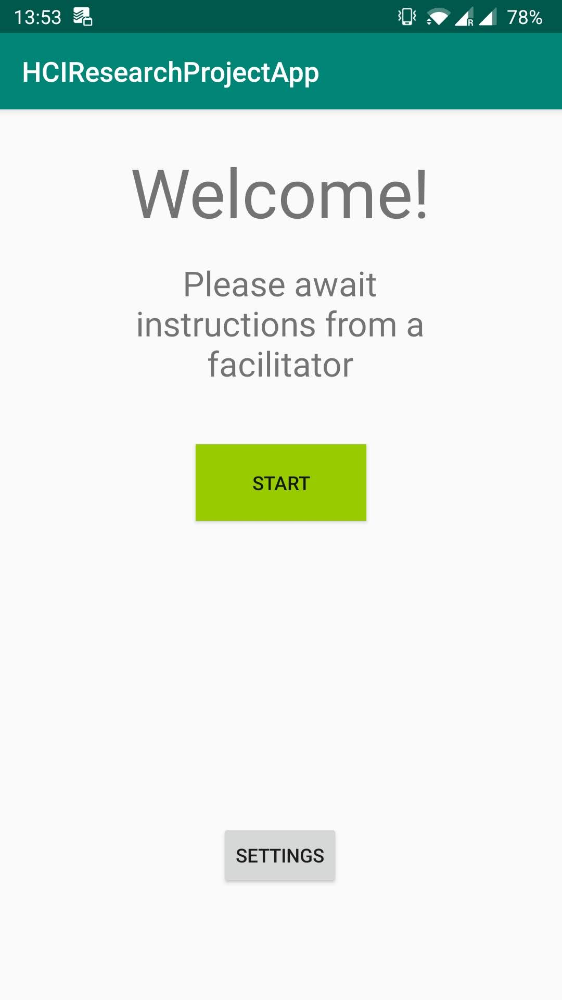

# Gesture Based Stress Study Using a Typing Test App
This application is made for a science project in COMPSCI 705 (Advance Topics in Human Computer Interactions) on the University of Auckland

## Explanation of the study
Our project examines the research question: 
> Does 3D smartphone gestures reduce stress compared to traditional 2D interaction methods?

The study will consist of three parts:
- A pre-study survey:
	- Here the participants will be asked questions to figure out their knowledge with smartphones and other related elements to the study
- An experimantal study:
	- Here the user will conduct the test unsing the application in this repository. See <Insert title here> for detail on the steps.
	- This study will measure the participants stress level and typing accuracy for a 2D interaction and a 3D gesture interaction
- A post-survy:
	- In this survey, the participant will be asked about their experience they had during the study. They will also be asked to self relfect on their stress level, and argue for which interaction method they prefere
	
### Elaboration of the applications part in the study
The application contains three main parts: 
1. A typing test with notification interuption and gesture recognition
2. A relaxation screen
3. A training screen

During the experimantal study, the facilitator will first set up the application with the correct gesture for the participant. Then the participant will start on the training task to familirize themselves with the typing test.
After training, the experiment starts. The different Task screens the user is greeted with all have the same objective; the user shall type the text, and when they are interupted by a notification they will dismiss it using the interaction method given for the current task.
After each task, a relaxation phase is added so as to reset the participants stress level after the typing test. Task 1 will test a 2D interaction method and Task 2 will test a 3D gesture. When all the tasks are completed, the first gesture test is done and the same procedure is repeated one more time with another gesture. After the second one, the experimental study is done.

To sum up, this is the application procedure:
1. Set up correct setings for participant
2. Complete Training task
3. Start and complete Task 1 with 2D interaction method
4. Complete Relaxation phase
5. Start and complete Task 2 
6. Complete 2nd relaxation phase with 3D gesture interaction
7. Repeat step 1-6 one more time with a different 3D gesture

## Screenshots of the application

